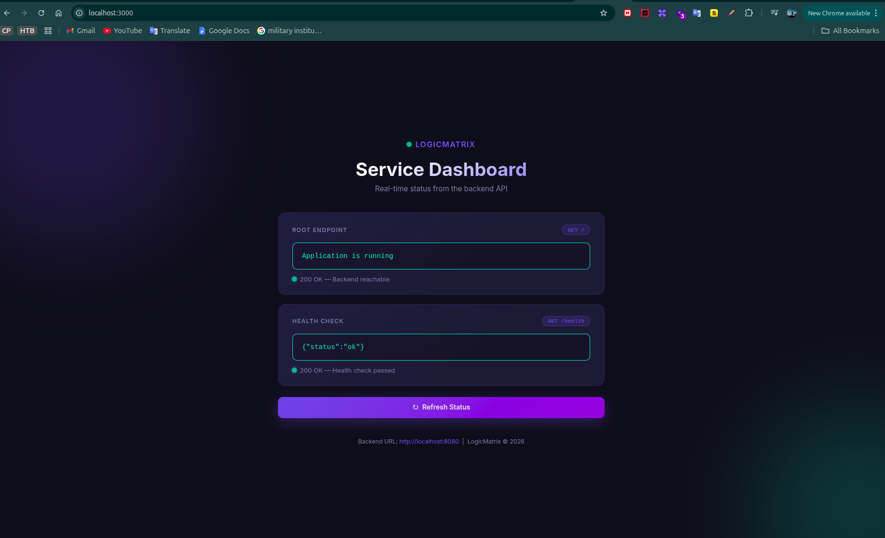
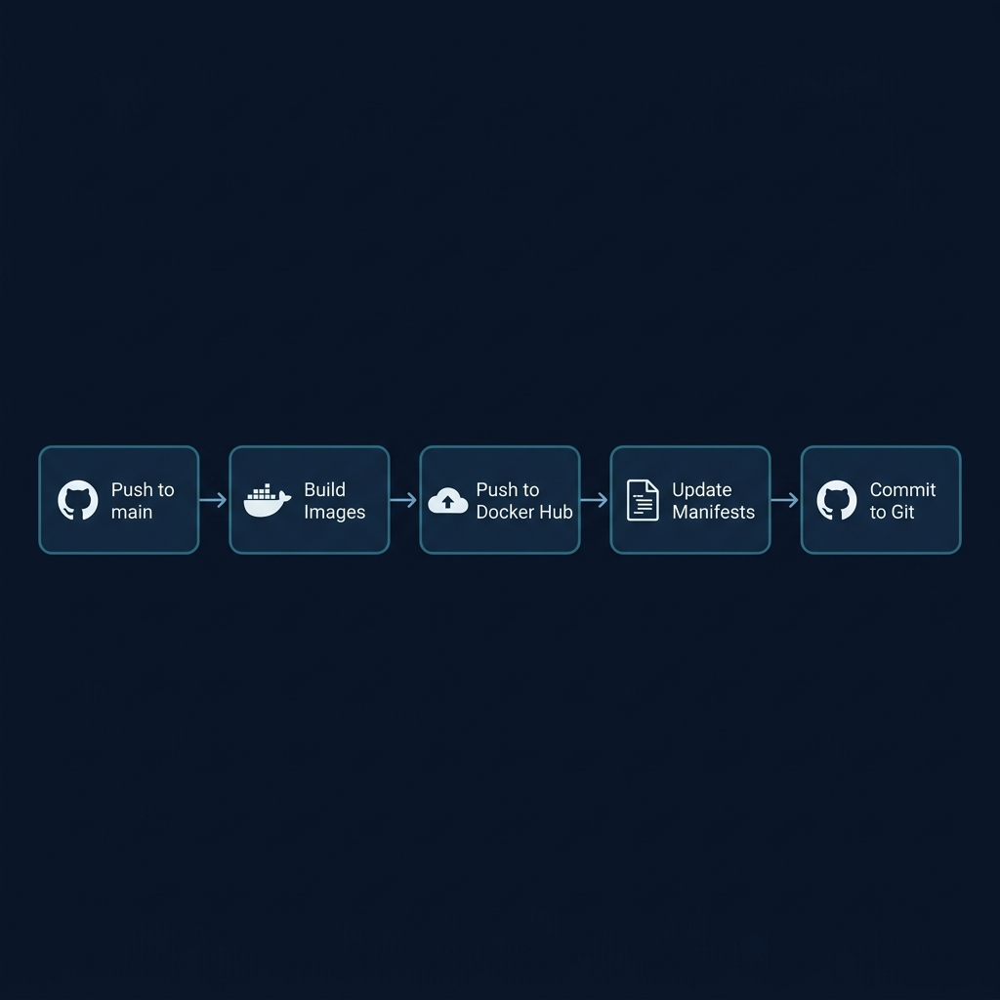
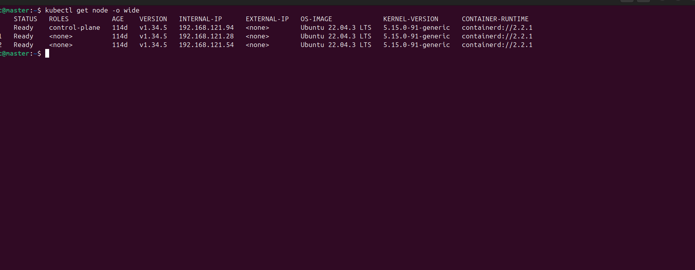

# LogicMatrix — DevOps Assessment

A two-tier web application with a Go backend and an HTML/Nginx frontend, containerized with Docker and deployed on Kubernetes.

---

## Application



The frontend displays live status from the backend API — showing the root endpoint response and health check result.

---

## Architecture


| Component | Description |
|---|---|
| **Frontend** | Static HTML served by Nginx on port 80 |
| **Backend** | Go HTTP API on port 8080 with `/` and `/health` endpoints |
| **Ingress** | Nginx Ingress Controller routes external traffic |
| **Namespace** | Both services run inside the `logicmatrix` namespace |

---

## CI/CD Pipeline



Every push to `main` triggers the pipeline automatically:

1. **Checkout** — pulls the latest code
2. **Build** — builds Docker images for backend and frontend
3. **Push** — pushes both images to Docker Hub (`nanil0034`)
4. **Update** — updates image tags in the K8s manifest files
5. **Commit** — commits the updated manifests back to the repository

---

## Kubernetes Cluster



The application is deployed on a 3-node Kubernetes cluster running version `v1.34.5`.

---

## Run Locally with Docker Compose

```bash
# Start both services
docker compose up -d

# Stop
docker compose down
```

- Frontend: http://localhost:3000
- Backend: http://localhost:8080

---

## Project Structure

```
LogicMatrix/
├── devops-assessment/
│   ├── backend/          # Go HTTP API
│   ├── frontend/         # Static HTML + Nginx
│   └── docker-compose.yml
├── K8s-manifest/         # Kubernetes deployment files
├── .github/workflows/    # GitHub Actions CI/CD
└── docs/                 # Troubleshooting & future improvements
```

---

## Docker Hub

Images are published at: https://hub.docker.com/repositories/nanil0034

| Image | Tag |
|---|---|
| `nanil0034/logicmatrix-backend` | `latest` / `<git-sha>` |
| `nanil0034/logicmatrix-frontend` | `latest` / `<git-sha>` |

---

## Required GitHub Secrets

| Secret | Value |
|---|---|
| `DOCKERHUB_USERNAME` | `nanil0034` |
| `DOCKERHUB_TOKEN` |  <access token> |
